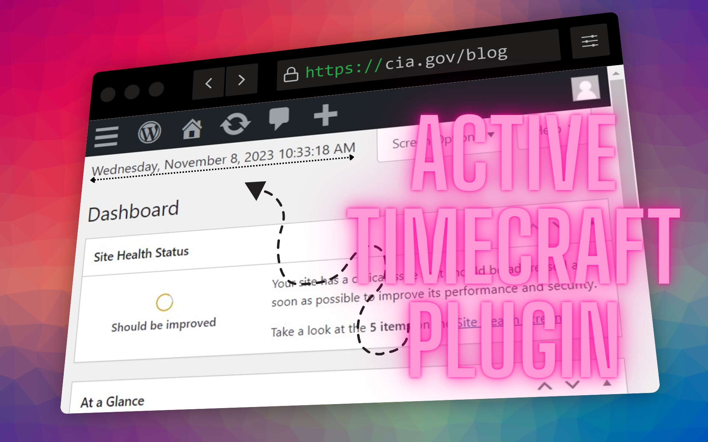

# TimeCraft

## Introduction

TimeCraft is an elegant and efficient WordPress plugin designed to provide users with an accurate and up-to-the-minute display of the current date and time on their dashboard. This plugin employs AJAX technology to ensure that the displayed time is consistently refreshed, allowing you to stay informed with precision. Whether you require real-time timekeeping for website management or simply desire a beautifully formatted clock on your dashboard, TimeCraft offers a reliable and professional solution.

## Features

- Real-time updates of the current date and time.
- Displays seconds for precise timing.
- Professional formatting for a polished look.
- Automatic updates every second.

## Example installation
How it looks if the Plugin is installed and active.

## Upcoming Features
We are actively working on enhancing TimeCraft with the following features:
- Multilingual Support: We are working on providing translations for multiple languages to make TimeCraft accessible to a broader audience.
- Customizable Styles: Soon, you will be able to customize the appearance of the displayed time using CSS to match your website's design.
- Settings Page: We are planning to introduce a settings page that will allow you to configure TimeCraft according to your preferences.
- Official WordPress Repo: TimeCraft will soon be available on the official WordPress Plugin Directory, making it easier to install and update.
- Time Insertion Feature: We are adding a feature that allows users to insert the current time into their pages or blog topics using a simple BBCode-like syntax.
Stay tuned for these exciting improvements!

## Installation

1. Upload the `TimeCraft.php` file to the `/wp-content/plugins/` directory.
2. Activate the plugin through the 'Plugins' menu in WordPress.
3. The current date and time will be displayed on your WordPress dashboard.
$${\color{lightblue}Frequently Asked Questions \space \color{lightgreen}(FQA)}$$

<strong>OPEN / CLOSE</strong>

<strong>Q: Is TimeCraft available in multiple languages?</strong>

A: Currently, TimeCraft supports English as its primary language. However, we're actively working on an update to introduce multi-language support, making TimeCraft accessible to a wider audience in the near future.
<!-- -->

<strong>Q: Can I customize the styling of the displayed time?</strong>

A: Absolutely! TimeCraft provides default styling to ensure a polished appearance. For further customization, you have the flexibility to apply your own CSS styles, allowing you to tailor the displayed time to match your website's design and branding.

<strong>Q: How frequently does TimeCraft update the displayed time?</strong>

A: TimeCraft leverages AJAX (Asynchronous JavaScript and XML) technology to update the displayed time at a frequency of once every second. This real-time synchronization ensures that the displayed time remains precise and consistently up-to-date, delivering accurate information to users. This mechanism guarantees that the plugin's timekeeping feature is synchronized with the system clock, offering the highest level of accuracy for time-related functions.

<strong>Q: Can I deactivate the real-time updates in TimeCraft?</strong>

A: TimeCraft does not currently offer the option to deactivate real-time updates. The plugin is designed to continuously refresh the displayed time to provide the most accurate and up-to-the-minute information. If you have specific feature requests or requirements, please feel free to reach out to our support for further assistance.

<strong>Q: Does TimeCraft have any dependencies or compatibility issues with other plugins?</strong>

A: TimeCraft is designed to work seamlessly with most WordPress configurations and themes. It has minimal dependencies and aims for high compatibility. If you encounter any compatibility issues, please reach out to our support for assistance.

<strong>Q: Can I find this plugin in the official WordPress plugin directory?
</strong>

A: Yes, TimeCraft will soon be available in the official WordPress plugin directory on wordpress.org. We are in the process of submitting it for review by the WordPress staff members. This review may take some time, but rest assured, you'll be able to access TimeCraft through the official directory once it's approved and published.

<strong>Q: Did you compromised the CIA to install Wordpress and the Plugin? oO</strong>

A: Thank you for your inquiry. I´ll never [try to hack](http://tryhackme.com/signup?referrer=654c99bfdb3248ace318f0a3) these organisations. The screenshot has made from [wp24.net](https://wp24.net) with [Screenshot.Rocks](https://screenshot.rocks) and edit by [Canva.com](https://www.canva.com/join/csy-ptw-kmm)
However, I must emphasize that I have no intention of engaging in any form of hacking at such orgs like [BND (Germany)](https://www.bnd.bund.de/), [BVT (Austria)](https://www.bvt.gv.at/), [CIA (USA)](https://www.cia.gov/), [DGSE (France)](https://www.dgse.fr/), [FSB (Russia)](https://www.fsb.ru/), [GCHQ (UK)](https://www.gchq.gov.uk/), [GRU (Russia)](https://eng.mil.ru/en/structure/forces/ground/structure/intelligence.htm), [MSS (China)](https://www.12339.gov.cn/), [MI6 (UK)](https://www.sis.gov.uk/), [NDB (Switzerland)](https://www.vbs.admin.ch/), [NSA (USA)](https://www.nsa.gov/), [PET (Denmark)](https://www.pet.dk/), [PLA General Staff Department (China)](http://eng.chinamil.com.cn/CMC/Departments/JointStaffDepartment), [PST (Norway)](https://www.pst.no/), [SÄPO (Sweden)](https://www.sapo.se/), [EU INTCEN (EU)]([https://www.intcen.europa.eu](https://de.wikipedia.org/wiki/INTCEN)/).

It is essential to acknowledge that individuals engaged in malicious activities will face legal consequences.
But yes, [try to hack](http://tryhackme.com/signup?referrer=654c99bfdb3248ace318f0a3) myself every second day in my own IT-Lab - former "[lab.one](http://lab.one)" now only at localhost.

<strong>Q: Why you add the CIA-URL to the screenshot exactly?</strong>

A: I´m a big fan of any instutation like the cia, nsa etc.
Moreover, we should maintain a deep respect for the dedicated professionals working within organizations such as the CIA.

These agencies play a crucial role in safeguarding our world, and their efforts are instrumental in maintaining the security and stability of our current global landscape.

These orgs search professionals - Go apply!

  If you have more question, feel free to ask me "github@brainhub24.com".

## Changelog

> **1.0**
> - This is the initial release of TimeCraft.

<!--## Upgrade Notice -->

## Contact

For support, feature requests, and bug reports, contact us at [github@brainhub24.com](mailto:github@brainhub24.com) or visit [TimeCraft Support](http://github.com/brainhub24/Wordpress-TimeCraft-Plugin/).

## Development

TimeCraft is open source software. 
Visit the [GitHub repository](http://github.com/brainhub24/Wordpress-TimeCraft-Plugin/) to contribute or report issues.
Constributions by: [@Brainhub24](http://github.com/brainhub24/), [@PHP24](http://github.com/PHP24/)

## License

TimeCraft is released under the [GPL-3.0](https://www.gnu.org/licenses/gpl-3.0.html) license.
